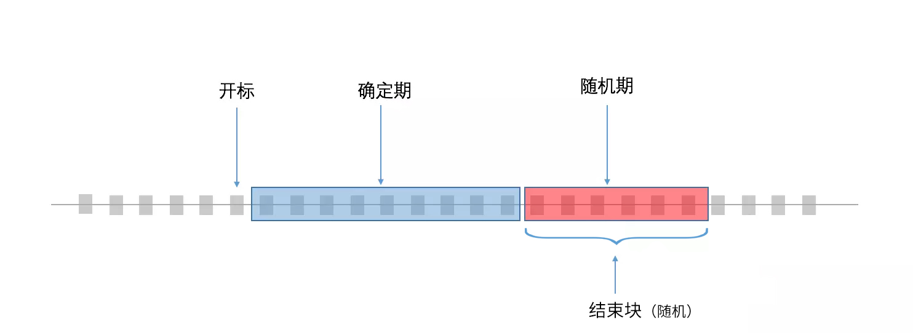

*********
详细设计
*********

NNS协议规范
===========

通常我们在互联网上使用的url如下

::

    http://aaa.bbb.test/xxx 

其中：

 - http是协议(protocol)，NNS服务请求时会把域名和协议分开传递
 - aaa.bbb.test是域名，NNS服务请求时使用域名的hash
 - xxx是路径，路径不是在dns的层次处理，对于nns也一样，如果有路径，交由其他的方式处理

NNS的协议使用字符串定义

以下均为暂定

http协议
--------

**http** 协议指向一个string,表示一个互联网地址

addr协议
--------

**addr** 协议指向一个string，表示一个NEO address，形如 AdzQq1DmnHq86yyDUkU3jKdHwLUe2MLAVv

script协议
----------

**script** 协议指向一个byte[],表示一个NEO ScriptHash，形如0xf3b1c99910babe5c23d0b4fd0104ee84ffeec2a5

同一域名的不同协议做不同处理

**http://abc.test** 可以指向 http://www.163.com

**addr://abc.test** 可以指向 AdzQq1DmnHq86yyDUkU3jKdHwLUe2MLAVv

**script://abc.test** 可以指向 0xf3b1c99910babe5c23d0b4fd0104ee84ffeec2a5

.. _namehash:

NameHash算法详解
===============

NNS中存储的域名为32字节散列值，而不是域名原文的文本。这有几个设计原因：

 - 处理过程统一，允许任意长度的域名。 
 - 一定程度保留了域名的隐私 
 - 将域名转换为散列的算法称为NameHash

域名协议
--------

通常我们在互联网上使用的url如下

::

    http://aaa.bbb.test/xxx 

其中：

1. http是协议(protocol)，NNS服务请求时会把域名和协议分开传递

2. aaa.bbb.test是域名，NNS服务请求时使用域名的hash

3. xxx是路径，路径不是在dns的层次处理，对于nns也一样，如果有路径，交由其他的方式处理

NNS服务使用的不是域名，而是域名的名字数组，这样处理起来更加直接

域名 aaa.bb.test 转成字节数组就是["test","bb","aa"]

你可以这样调用解析

::

        NNS.ResolveFull("http",["test","bb","aa"]);

交由合约去计算出namehash ## NameHash算法
NameHash算法是将域名转成DomainArray以后，逐级连接计算hash的方法，代码如下:

::

        //域名转hash算法
        static byte[] nameHash(string domain)
        {
            return SmartContract.Sha256(domain.AsByteArray());
        }
        static byte[] nameHashSub(byte[] roothash, string subdomain)
        {
            var domain = SmartContract.Sha256(subdomain.AsByteArray()).Concat(roothash);
            return SmartContract.Sha256(domain);
        }
        static byte[] nameHashArray(string[] domainarray)
        {
            byte[] hash = nameHash(domainarray[0]);
            for (var i = 1; i < domainarray.Length; i++)
            {
                hash = nameHashSub(hash, domainarray[i]);
            }
            return hash;
        }

快速解析
-------

完整的解析传入整个DomainArray,由智能合约去逐个检查一层层解析。
计算NameHash的过程也可以挪到客户端算好，再传入智能合约。 调用方式如下

::

    //查询 http://aaa.bbb.test
    var hash = nameHashArray(["test","bbb"]);//可以客户端计算
    NNS.Resolve("http",hash,"aaa");//调用智能合约

或者

::

    //查询 http://bbb.test
    var hash = nameHashArray(["test","bbb"]);//可以客户端计算
    NNS.Resolve("http",hash,"");//调用智能合约

你也许会考虑查询 aaa.bbb.test 的过程为什么不是这样

::

    //查询 http://aaa.bbb.test
    var hash = nameHashArray(["test","bbb","aaa"]);//可以客户端计算
    NNS.Resolve("http",hash,"");//调用智能合约

我们要考虑aaa.bb.test
是否拥有一个独立的解析器，如果aaa.bb.test被卖给了别人，他指定了一个独立的解析器，这样是可以查询到的。
如果aaa.bb.test 并没有独立的解析器，他是有bb.test的解析器来解析。
那么这样就无法查询到

而采用第一种查询方式，无论aaa.bb.test
是否拥有一个独立的解析器，都可以查询到。

顶级域名合约详解
===============

顶级域名合约的函数入口如下:

::

    public static object Main(string method, object[] args)

部署时采用 参数 0710，返回值 05 的配置

顶级域名的接口分为三部分

 - **通用接口** 不需要权限验证，所有人都可以调用
 - **所有者接口** 仅接受所有者签名，或者由所有者脚本调用有效
 - **注册器接口** 仅接受由注册器脚本调用有效

通用接口
---------

通用接口，不需要权限验证。 代码如下

::

    if (method == "rootName")
        return rootName();
    if (method == "rootNameHash")
        return rootNameHash();
    if (method == "getInfo")
        return getInfo((byte[])args[0]);
    if (method == "nameHash")
        return nameHash((string)args[0]);
    if (method == "nameHashSub")
        return nameHashSub((byte[])args[0], (string)args[1]);
    if (method == "nameHashArray")
        return nameHashArray((string[])args[0]);
    if (method == "resolve")
        return resolve((string)args[0], (byte[])args[1], (string)args[2]);
    if (method == "resolveFull")
        return resolveFull((string)args[0], (string[])args[1]);

根域名
~~~~~~

::

    rootName()

返回当前顶级域名合约对应的根域名 返回值为string

顶级域名哈希
~~~~~~~~~~~

::

    rootNameHash()

返回当前顶级域名合约对应的NameHash 返回值为byte[]

域名信息
~~~~~~~~

::
    
    getOwnerInfo(byte[] namehash)

返回一个域名的信息 返回值为一个如下数组

::

    [
        byte[] owner//所有者
        byte[] register//注册器
        byte[] resolver//解析器
        BigInteger ttl//到期时间
    ]

单级域名哈希
~~~~~~~~~~~

::

    nameHash(string domain)

将域名的一节转换为NameHash 比如

::

    nameHash("test") 
    nameHash("abc")

返回值为byte[]

子域名哈希
~~~~~~~~~

::

    nameHashSub(byte[] domainhash,string subdomain)

计算子域名的NameHash, 比如

::

    var hash = nameHash("test");
    var hashsub = nameHashSub(hash,"abc")//计算abc.test 的namehash

返回值为byte[]

域名哈希
~~~~~~~~

::

     nameHashArray(string[] nameArray)

计算NameArray的NameHash，aa.bb.cc.test,
对应的nameArray是["test","cc","bb","aa"]

::

    var hash = nameHashArray(["test","cc","bb","aa"]);

域名解析
~~~~~~~~

::

    resolve(string protocol,byte[] hash,string or int(0) subdomain)

- **protocol** 协议类型。比如http是将域名映射为一个网络地址，addr是将域名映射为一个NEO地址（这可能是最常用的映射）
- **hash** 要解析的域名Hash
- **subdomain** 要解析的子域名Name

应用代码如下

::

    var hash = nameHashArray(["test","cc","bb","aa"]);//客户端计算好
    resolve("http",hash,0)//合约解析 http://aa.bb.cc.test

    or

    var hash = nameHashArray(["test","cc","bb");//客户端计算好
    resolve("http",hash,“aa")//合约解析 http://aa.bb.cc.test

返回类型为byte[]，具体byte[]如何解读，由不同的协议定义，addr协议，byte[]就存的字符串。
协议约定另外撰文。

除了二级域名的解析，必须使用resolve("http",hash,0)的方式，其余的解析建议都使用resolve("http",hash,"aa")的方式。

域名完整解析
~~~~~~~~~~~~

::

    resolveFull(string protocol,string[] nameArray)

解析域名，完整模式

- **protocol** 协议类型
- **nameArray** 要解析的域名数组

这种解析方式唯一的不同就是会逐级验证一下所有权是否和登记的一致，一般用resolve即可

返回类型同resolve

所有者接口
---------

所有者接口全部为 owner\_SetXXX(byte[] srcowner,byte[] nnshash,byte[]
xxx)的形式。 xxx 均是scripthash。

返回值均为 一个byte array [0] 表示失败 [1] 表示成功

所有者接口均接受账户地址直接签名调用和智能合约所有者调用。

如果所有者是智能合约，那么所有者应该自己判断权限，不满足条件，不要发起对顶级域名合约的appcall

域名转让
~~~~~~~~

::

    owner\_SetOwner(byte[] srcowner,byte[] nnshash,byte[] newowner)

转让域名所有权，域名的所有者可以是一个账户地址，也可以是一个智能合约。

- **srcowner** 仅在 所有者是账户地址时用来验证签名，他是地址的scripthash
- **nnshash** 是要操作的域名namehash
- **newowner** 是新的所有者的地址的scripthash

域名注册
~~~~~~~~

::

    owner\_SetRegister(byte[] srcowner,byte[] nnshash,byte[] newregister)

设置域名注册器合约（域名注册器为一个智能合约）

域名注册器参数形式必须也是0710，返回05

必须实现如下接口：

::

        public static object Main(string method, object[] args)
        {
            if (method == "getSubOwner")
                return getSubOwner((byte[])args[0], (string)args[1]);
            ...

        getSubOwner(byte[] nnshash,string subdomain)

任何人可调用注册器的接口检查子域的所有者。

对于域名注册器的其他接口形式不做规范，官方提供的注册器会另外撰文说明。

用户自己实现的域名注册器，仅需实现getSubOwner接口

域名解析
~~~~~~~~

::

    owner_SetResolve(byte[] srcowner,byte[] nnshash,byte[] newresolver)

设置域名解析器合约（域名解析器为一个智能合约）

域名解析器参数形式必须也是0710，返回05

必须实现如下接口

::

        public static byte[] Main(string method, object[] args)
        {
            if (method == "resolve")
                return resolve((string)args[0], (byte[])args[1]);
            ...
        
        resolve(string protocol,byte[] nnshash)

任何人可调用解析器接口进行解析

对于域名解析器的其它接口形式不做规范，官方提供的解析器会另外撰文说明。

用户自己实现的域名解析器，仅需实现resolve 接口

注册器接口
----------

注册器接口由注册器智能合约进行调用，只有一个

::

    register_SetSubdomainOwner(byte[] nnshash,string subdomain,byte[] newowner,BigInteger ttl)

注册一个子域名

 - **nnshash** 是要操作的域名namehash
 - **subdomain** 是要操作的子域名
 - **newowner** 是新的所有者的地址的scripthash
 - **ttl** 是域名过期时间（区块高度）

成功返回 [1] ,失败返回 [0]

所有者合约详解
=============

所有者合约工作方式
-----------------

所有者合约采用Appcall的形式调用顶级域名合约的owner_SetXXX 接口
::

        [Appcall("dffbdd534a41dd4c56ba5ccba9dfaaf4f84e1362")]
        static extern object rootCall(string method, object[] arr);

顶级域名合约会检查调用栈，取出调用它的合约和顶级域名合约管理的所有者进行比对。

所以只有所有者合约可以实现管理。

所有者合约的意义
===============

用户可以用所有者合约实现复杂的合约所有权模式

比如：

- 双人共有，双人签名操作。
- 多人共有，投票操作。

注册器合约详解
==============
                                         
注册器合约采用Appcall的形式调用顶级域名合约的register\_SetSubdomainOwner接口

::

        [Appcall("dffbdd534a41dd4c56ba5ccba9dfaaf4f84e1362")]
        static extern object rootCall(string method, object[] arr);

顶级域名合约会检查调用栈，取出调用它的合约和顶级域名合约管理的注册器进行比对。

所以只有指定的注册器合约可以实现管理。

合约入口
--------

注册器参数形式必须也是0710，返回05

::

        public static object Main(string method, object[] args)
        {
            if (method == "getSubOwner")
                return getSubOwner((byte[])args[0], (string)args[1]);
            if (method == "requestSubDomain")
                return requestSubDomain((byte[])args[0], (byte[])args[1], (string)args[2]);
            ...

查询拥有者
---------

::

    getSubOwner(byte[] nnshash,string subdomain)

此接口为注册器规范要求，必须实现，完整解析域名时会调用此接口验证权利

nnshash 为域名hash

subdomain 为子域名

返回 byte[] 所有者地址，或者空

FIFS域名申请
-----------

::

        requestSubDomain(byte[] who,byte[] nnshash,string subdomain)

此接口为演示的先到先得注册器使用，用户调用注册器的这个接口申请域名

 - **who** 谁在申请
 - **nnshash** 申请哪个域名
 - **subdomain** 申请的子域名

解析器合约详解
==============

1.解析器自己保存解析信息

2.顶级域名合约会以nep4的方式调用解析器的解析接口获取解析信息。

3.解析器设置解析数据时采用Appcall的形式调用顶级域名合约的getInfo接口来验证域名所有权

::

        [Appcall("dffbdd534a41dd4c56ba5ccba9dfaaf4f84e1362")]
        static extern object rootCall(string method, object[] arr);

任何合约都可以通过 appcall 顶级域名合约getInfo接口的方式来验证域名所有权

合约入口
--------

注册器参数形式必须也是0710，返回05

::

        public static byte[] Main(string method, object[] args)
        {
            if (method == "resolve")
                return resolve((string)args[0], (byte[])args[1]);
            if (method == "setResolveData")
                return setResolveData((byte[])args[0], (byte[])args[1], (string)args[2], (string)args[3], (byte[])args[4]);
            ...

解析域名
-------

::

    resolve(string protocol,byte[] nnshash)

此接口为解析器规范要求，必须实现，完整解析域名时会调用此接口最终解析

- **protocol** 协议类型
- **nnshash** 要解析的域名

返回byte[] 解析数据

设置解析参数
-----------

::

    setResolveData(byte[] owner,byte[] nnshash,string or int[0] subdomain,string protocol,byte[] data)

此接口为演示的标准解析器所有，所有者（目前还只支持账户地址所有者）可以调用此接口配置解析数据

- **owner** 所有者
- **nnshash** 设置哪个域名
- **subdomain** 设置的子域名（可以传0，如果设置的就是域名解析，非子域名传0）
- **protocol** 协议字符串
- **data** 解析数据

返回[1]表示成功 或者[0]表示失败

投标竞拍域名注册方式详解
======================

竞标机制
--------

ENS采用密封竞价机制，通过混淆金来实现隐藏真实出价，但这种机制无法实现完全密封，真实出价不会超出公开的总出价。

密封出价的用户体验很差，用户需要记住一串密码，而且必须在短暂的揭标期向合约出示密码，否则无法找回资金。

NNS仍然会采用竞标的方式实现域名的初始注册分发，但是和ENS不同，我们采用透明的増价竞拍机制。

这样做的好处是，用户不需要记住密文和揭标期，只要竞标结束，最终结果就可以出现。
但是透明増价竞拍会有一个问题，如果竞拍期是确定的，那么没人愿意在一开始的时候就为域名出价，这样别人就可以在快结束的时候出比你稍多一点的钱来获得域名。

**确定期**

为了解决先手劣势的问题，我们在竞拍结束时间上引入了随机性，竞拍分两个阶段，第一阶段是确定期，例如3天，这一期间的所有出价都有效。

**随机期**

如果确定期最后一天有人出价，则进入两天的随机期，否则竞拍即在确定期结束。
在随机期里竞拍结束时间是不确定的，需要等到两天后的未来块的哈希值确定，根据区间大小，越靠后出价越可能落在竞拍结束时间之后从而无效，
所以你应当尽早给出你的心理价位。

**竞价结束**

随机期结束后，利用未来块哈希来确定随机期里面的竞价结束块，统计从开标到此结束块的出价，就可以确定中标人。

这种竞拍方式的最终结果是，如果你觉得没人和你抢拍域名，那么你只需要在开标前两天出价，第三天确定期结束即可获得域名。

如果有竞争，那么竞争主要发生在确定期和随机期交替的两端。
通过在竞拍结束时间引入随机性，并且越靠后出价落在有效期可能性越小，避免了透明增加竞拍中的后手优势问题。

交易服务
--------

交易服务支持域名登记员发布域名所有权转让邀约，支持固定价格转让和荷兰式减价拍卖方式转让。 

可循环分配代币SGAS技术实现
==============================

为了实现NNS系统的良性发展，NNS引入了可循环的代币系统，同时引入股权代币用以对系统收益的再分配提供证明。系统的组成分为三个部分：

1. NNC股权证明代币

2. SGAS NEP5代币合约。

3. Coinpool 奖金池合约。

NNC主要作用是在域名拍卖获得的收益进行再分配时提供股权证明。

SGAS是为了方便将GAS用于应用合约中而引入的与GAS *1:1* 绑定的NEP5资产。CoinPool是接收域名拍卖手续费并进行再分配管理的合约。

重新分配机制
------------

NNS在用户进行域名拍卖的时候会收取手续费，这笔手续费收益将依据NNS用户的NNC持有数量进行再分配，完全重新分配给NNC持有者。

领奖机制	
------------

NNS系统的手续费收益将会转到奖池合约，由奖池合约进行记录，用户依据持有的NNC通过奖池合约进行领取。

奖池细节
---------------

域名拍卖收取到的所有SGAS都会重新分配出去。分配的比例参照用户NNC持有量。出于成本考虑，我们用一万个块做单位来统计和分配收取到的SGAS。当用户拥有一笔NNC utxo资产并至少跨两个单位将它使用后，你将可以分红到从拥有到使用之间的SGAS。每笔NNC utxo资产在领取sgas时最高只能领取15个单位内的SGAS，如果持有时间超过15单位，将分多次领取。也就是说，用户如果一直持有这份UTXO没有交易出去，那么将会一直收到SGAS的分红，但是无法领取，只有用户将UTXO交易出去后，才能领取对应的分红。

SGAS接口（仅述相比NEP5多出来的接口）
~~~~~~~~~~~~~~~~~~~~~~~~~~~~~~~~~~~~~~

SGAS首先符合NEP5规范，NEP规范接口不再赘述

**mintTokens**

通过GAS换取等量的SGAS，通过InvokeContract，转账到SGAS合约账户，然后调用合约的mintTokens转等量的SGAS到自己的账户。需要签名。

**refund**

通过SGAS合约将SGAS兑换为等量GAS，由SGAS合约对用户进行身份校验然后构造合约交易将SGAS合约账户的GAS转到用户账户，同时扣取用户账户的SGAS。需要签名。

**migrate**

用于合约升级，当合约出现问题需要更新版本时使用。只有超级管理员有权限调用。

CoinPool接口
~~~~~~~~~~~~~~~~~~~~

**setSGASIn(byte[] txid)**

由NNS注册器合约调用，用于向奖池转sgas收益。需要合约地址验证。只能通过NNS注册器调用。参数txid为转账交易的交易id。

**countSGASOnBlock(BigInteger blockid)**

用于查看保存在指定区块区间内的奖金数量。参数blockId为查询的区块高度。

**Claim**

用于用户领取奖池内的SGAS奖励。
